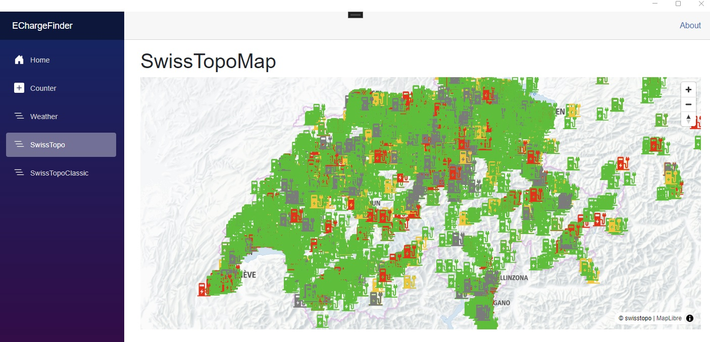

# EChargeFinder
This application has the goal to collect and use the [E-Charging station information](https://opendata.swiss/de/dataset/ladestationen-fuer-elektroautos) from [opendata.swiss](https://opendata.swiss/de) and display this information on different maps. 
The central purpose is to explore how the different maps work and how the information can be displayed. 
The following maps shall be used in this project: 
- [OpenStreeMap](https://www.openstreetmap.org/#map=8/46.825/8.224)
- [GoogleMaps](https://developers.google.com/maps/documentation?hl=de)
- [geo.admin.ch](https://api3.geo.admin.ch/index.html)
- [geocat.ch](http://geocat.ch/)
- [mapbox](https://www.mapbox.com/)

To gain initial experience Blazor is the desired technology for this project.  

